# Favorite Books App
This project consists of 5 main pages: the home page, detail page, search page, my favorite books page, and book categories page, developed using the Google Books API. During the development process of the project, the MVVM architecture and Provider State Management method were utilized.

## The Libraries and Technologies
- MVVM (Model-View-ViewModel) Architecture: A software architectural pattern that separates the application's data (model), user interface (view), and logic (view model) components to ensure separation of concerns and maintainability. (https://learn.microsoft.com/en-us/dotnet/architecture/maui/mvvm)
- Google Books API: An API provided by Google that allows access to a vast collection of books and related information. (https://developers.google.com/books/docs/v1/using)
- mobx => https://pub.dev/packages/mobx
- flutter_mobx => https://pub.dev/packages/flutter_mobx
- provider => https://pub.dev/packages/provider
- mobx_codegen => https://pub.dev/packages/mobx_codegen
- build_runner => https://pub.dev/packages/build_runner
- flutter_svg => https://pub.dev/packages/flutter_svg
- auto_size_text => https://pub.dev/packages/auto_size_text
- http => https://pub.dev/packages/http

## Application Pages
### Onboard
- The application includes three introductory screens that provide brief descriptions and visuals about the app.

<table>
  <tr>
    <td>Onboard Page One</td>
    <td>Onboard Page Two</td>
    <td>Onboard Page Three</td> 
  </tr>  
  <tr>
    <td>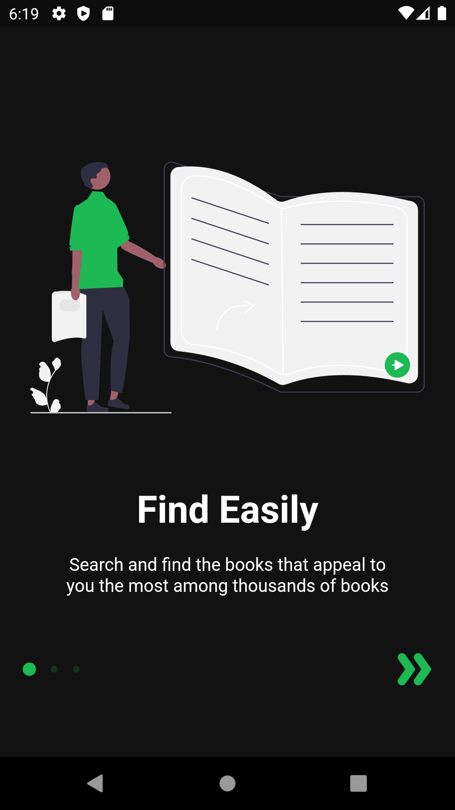</td>
    <td>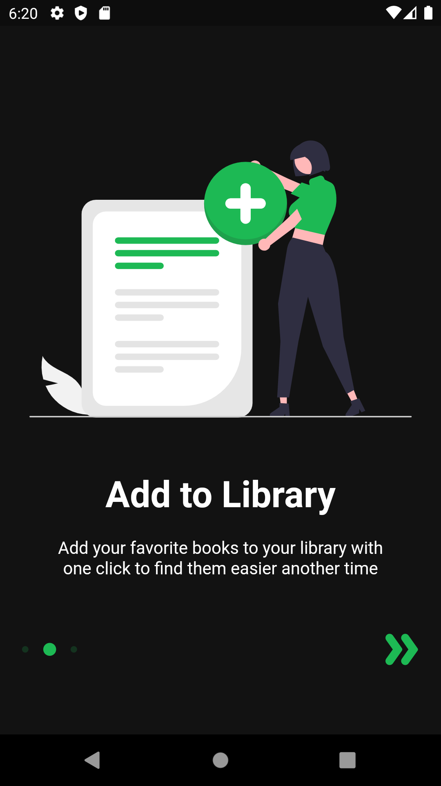</td>
     <td>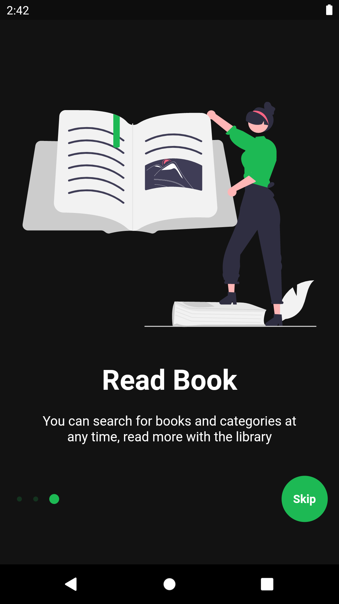</td>
  </tr>
</table>

### Home Page
- The introductory screens welcome the user with a combination of images and written headlines. Underneath the headlines, there are lists of trending and best-selling books. When clicked on any book in these lists, the user can transition to a detailed page that provides descriptions and information about the book.

<table>
  <tr>
    <td>Home Page One</td>
   <td>Home Page Two</td>
  </tr>  
  <tr>
    <td>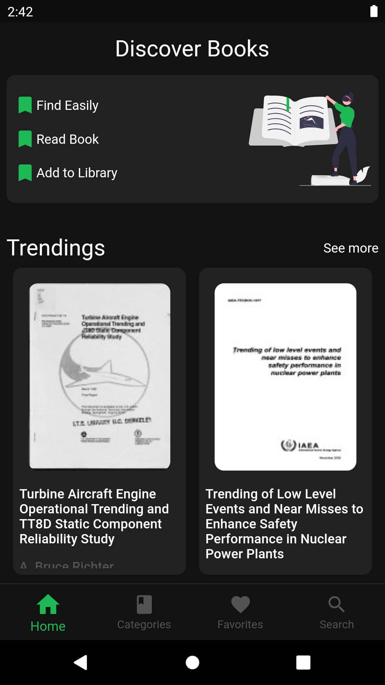</td>
   <td>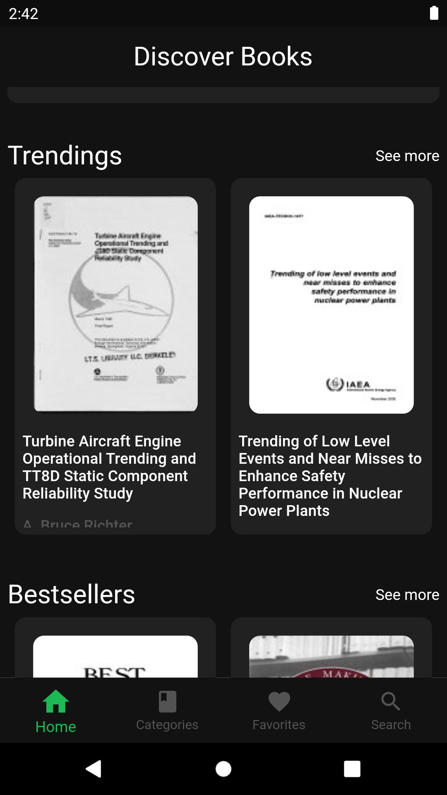</td>
  </tr>
</table>

### Book Categories Page
- This page lists the book categories obtained from the Google Books API. When a category is clicked, the page will display the books belonging to that category.

<table>
  <tr>
    <td>Categories Page </td>
   <td>Loading</td> 
    <td>Categories List</td>
  </tr>  
  <tr>
    <td>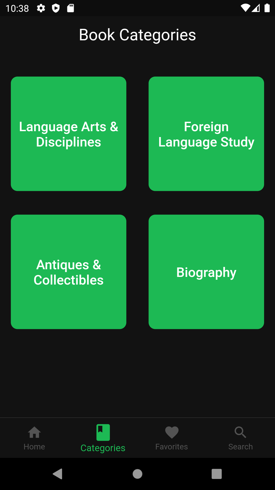</td>
   <td>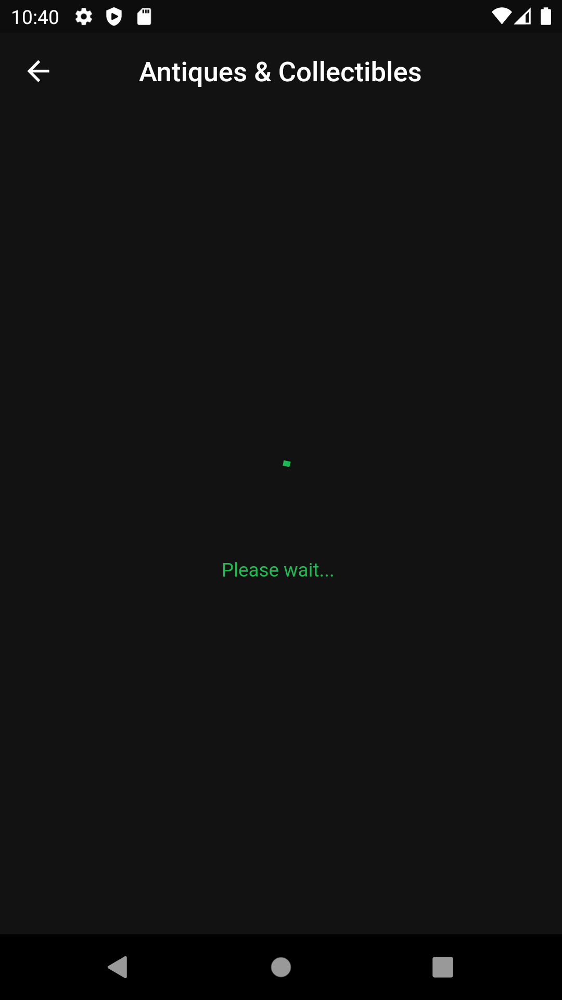</td>
    <td>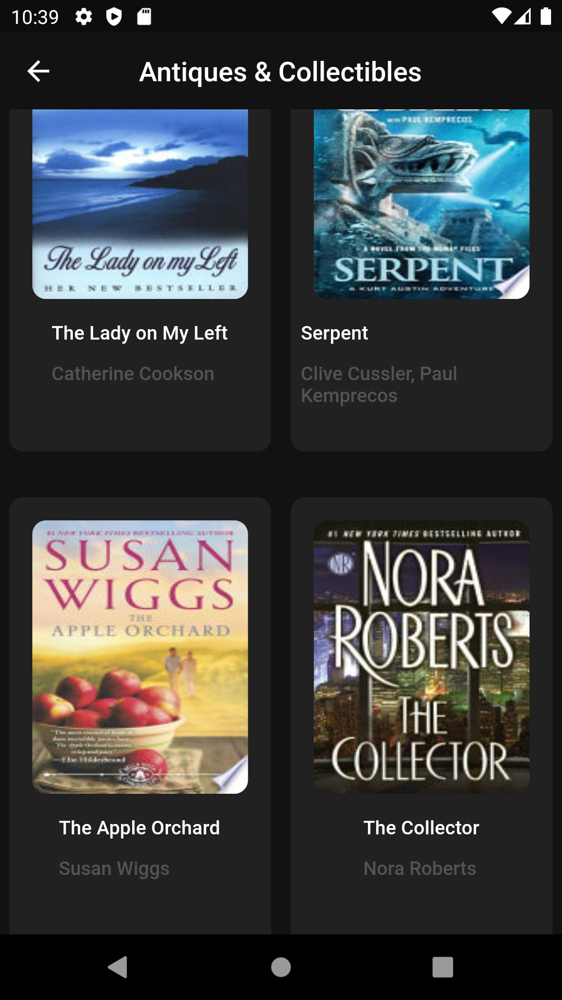</td>
  </tr>
</table>

### My Favorite Books Page
- When a book is clicked in the application, it will navigate to the book detail page. On the book detail page, there will be a heart icon that allows you to add the selected book to your favorites section. When you click the heart icon, the chosen book will be automatically listed in the "My Favorite Books" page. Later, you can visit this page and remove any book you desire from your favorites.

<table>
  <tr>
    <td>Favorites Page </td>

  </tr>  
  <tr>
    <td>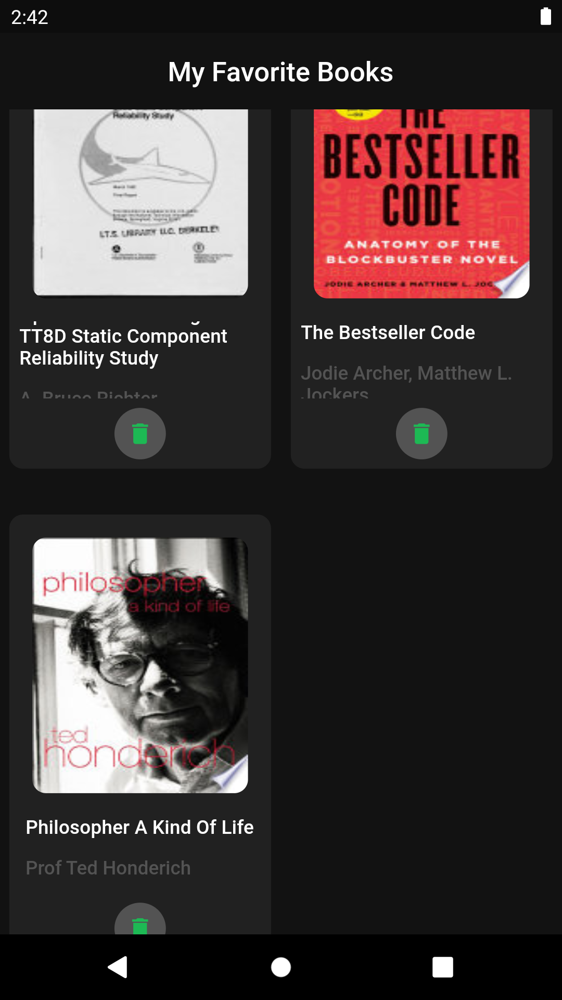</td>

  </tr>
</table>

### Book Detail Page
- On the book detail page, there will be a heart icon that allows you to add the selected book to your favorites section. When you click the heart icon, the chosen book will be automatically listed in the "My Favorite Books" page. Later, you can visit this page and remove any book you desire from your favorites.

<table>
  <tr>
    <td>Book Detail Page </td>
      <td>Book Detail Bottomsheet </td>

  </tr>  
  <tr>
    <td>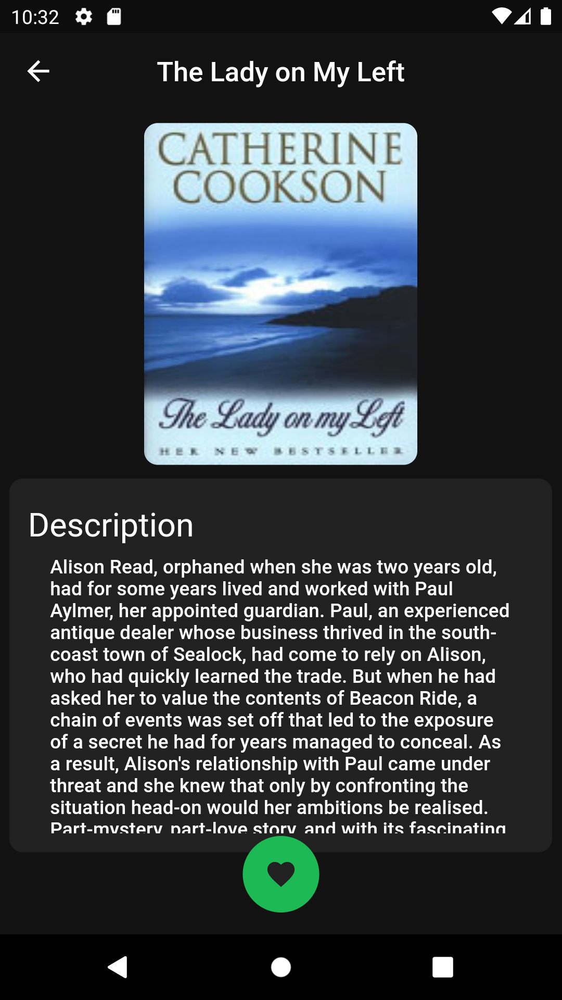</td>
<td>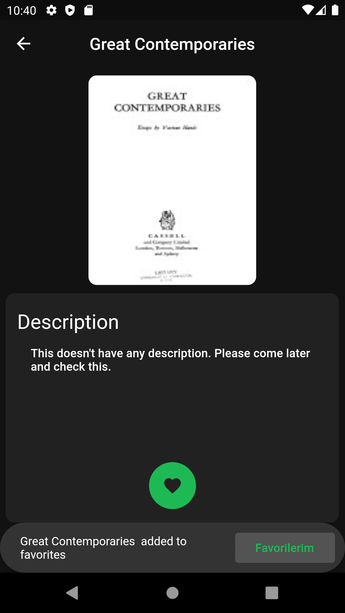</td>
  </tr>
</table>

### Search Page
- This is the page where you can search for any desired book, category, or author. You can enter any keyword or term in the search bar to access the desired information.

<table>
  <tr>
    <td>Book Search Page </td>
      <td>Book Search List </td>

  </tr>  
  <tr>
    <td>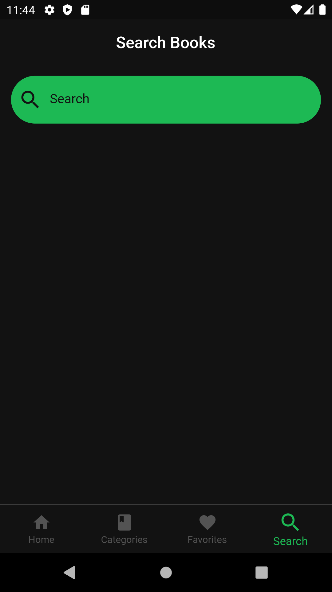</td>
<td>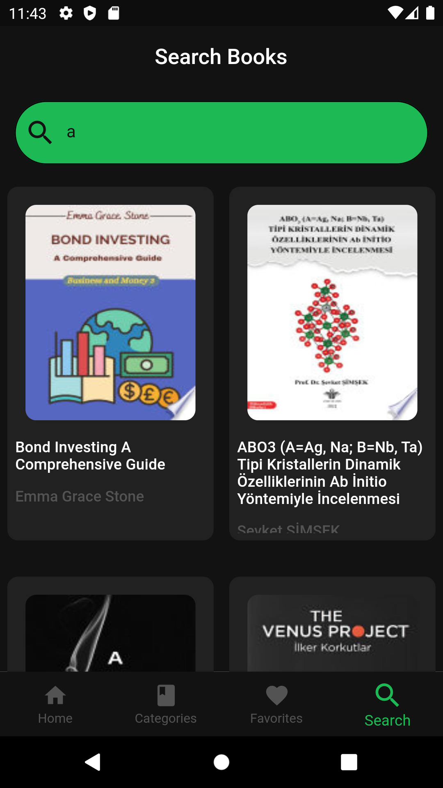</td>
  </tr>
</table>

##    Technical Stuffs   

### Multi Provider
<table>
  <tr>
    <td>Multi Provider</td>
  </tr>  
  <tr>
    <td>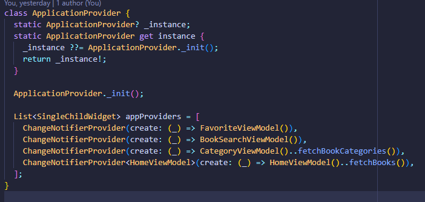</td>
  </tr>
</table>
### Provider- View Model
<table>
  <tr>
    <td>Provider-View Model</td>
  </tr>  
  <tr>
    <td>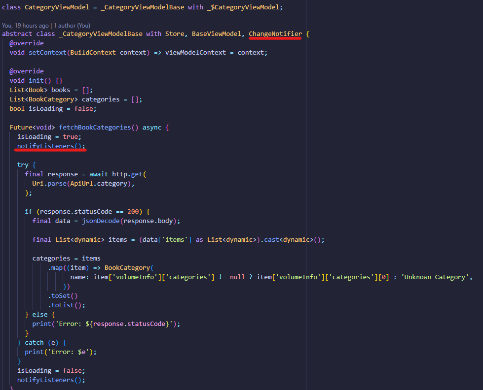</td>
  </tr>
</table>
### Provider-View
<table>
  <tr>
    <td>Provider-View </td>
  </tr>  
  <tr>
    <td>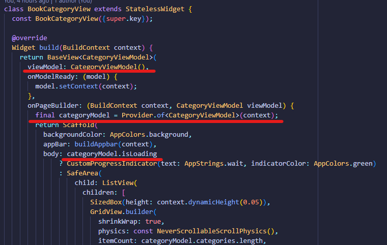</td>
  </tr>
</table>

### Book Model
<table>
  <tr>
    <td>Book Model </td>
  </tr>  
  <tr>
    <td>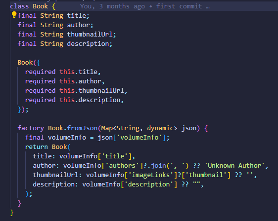</td>
  </tr>
</table>

### Color Palette
<table>
  <tr>
    <td>App Color Palette </td>
  </tr>  
  <tr>
    <td>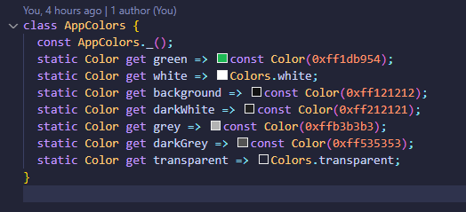</td>
  </tr>
</table>
